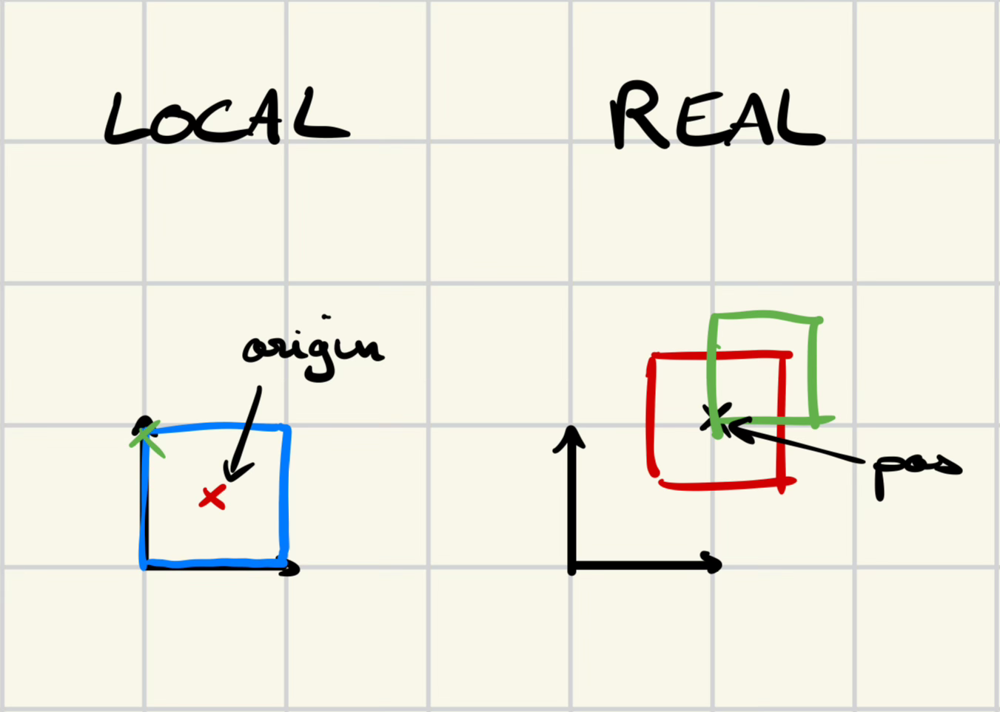

## 🔺 Système de coordonnées

Chaque `Shape` définit :
- des **sommets locaux** (`vertices`) décrits dans un repère propre à la forme
- une **position dans le monde** (`position`)  
- une **origine (`origin`)** qui sert de point de référence pour placer la forme 

📌 Schéma : 

.
├── assets
├── docs
│   └── img
├── src
│   ├── Engine                  
│   │   ├── Controller          <-- Gère les input de l'Engine
│   │   ├── Model               <-- Defini les données
│   │   │   ├── Components      <-- Utilitaires pour formes
│   │   │   ├── Entities        <-- Forme avancés
│   │   │   └── Geometry        <-- Forme de base du modèle
│   │   └── Physics             <-- Agit sur les données
│   │   └── View                <-- Gère les output de l'Engine (le rendu)
│   └── Utils
└── tests